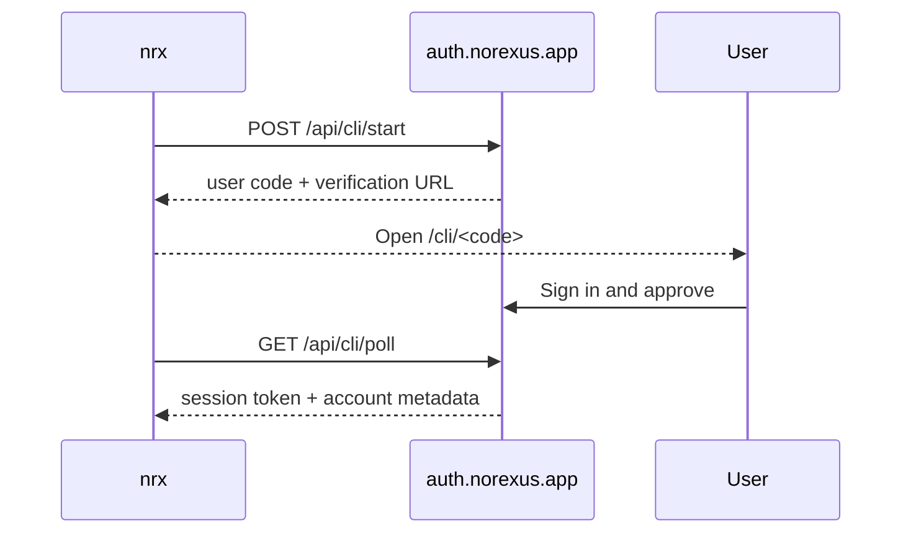

NOREXUS Auth owns the sign-in and approval surface for NOREXUS users and developer tools.

## Owns

- Login and signup screens
- OAuth, magic-link, password, and passkey flows
- Callback and session exchange
- Shared cookies
- CLI approval pages
- CLI auth HTTP APIs
- Auth email templates

## CLI pairing flow

## Boundary

CLI users should not need Supabase keys. Service-role keys stay server-only inside Auth-owned server paths.
